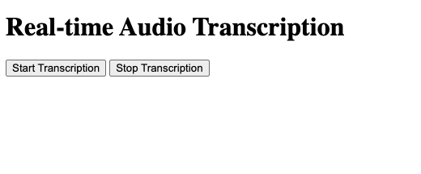
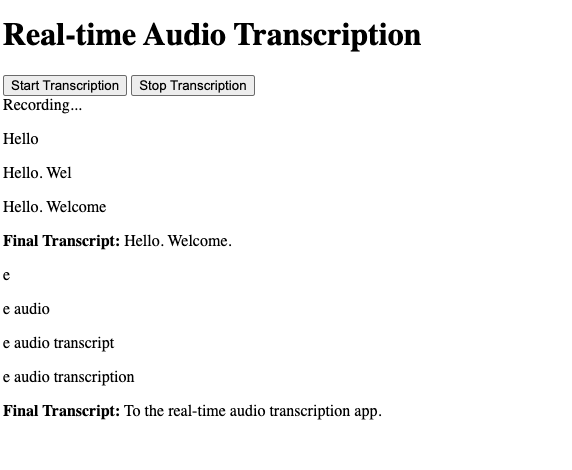

# Real-time Audio Transcription

This project provides a real-time audio transcription service using AWS Transcribe, Node.js, Express, and Socket.IO. It captures audio from the browser, streams it to AWS Transcribe for transcription, and displays the transcribed text in real-time.

## Project Overview

The application allows users to:
- Start and stop audio transcription via a web interface.
- See real-time transcriptions as they speak.
- View final transcriptions once the audio stream ends or is stopped.

### Screenshot

Below is a screenshot of the application in action:
[test_homepage]


[result]

## Prerequisites

Before running the project, ensure you have the following:

- **Node.js** (v22.14.0 or compatible version)
- **npm** (Node Package Manager)
- **AWS Account** with access to AWS Transcribe
- AWS credentials configured (e.g., via `aws configure` or environment variables)

## Installation

1. **Clone the repository**:
   ```bash
   git clone https://github.com/fahmizainal17/Real_Time_Transcription_Project.git
   cd Real_Time_Transcription_Project
   ```

2. **Install dependencies**:
   ```bash
   npm install
   ```

   This will install the required packages listed in `package.json`, including:
   - `express`
   - `socket.io`
   - `@aws-sdk/client-transcribe-streaming`
   - `http` and `path` (built-in Node.js modules)

3. **Configure AWS Credentials**:
   Ensure your AWS credentials are set up for the `us-west-2` region (or update the region in `server.js`):
   - Run `aws configure` and provide your Access Key ID, Secret Access Key, and region.
   - Alternatively, set environment variables:
     ```bash
     export AWS_ACCESS_KEY_ID='your-access-key'
     export AWS_SECRET_ACCESS_KEY='your-secret-key'
     export AWS_REGION='us-west-2'
     ```

## Usage

1. **Start the server**:
   Run the following command to start the server on port 3000 (or set a custom port via the `PORT` environment variable):
   ```bash
   PORT=3000 npm start
   ```

   You should see the message:
   ```
   Server running on port 3000
   ```

2. **Access the application**:
   Open a browser and navigate to:
   ```
   http://localhost:3000
   ```

3. **Start transcription**:
   - Click the "Start Transcription" button to begin recording audio.
   - Speak into your microphone, and the transcription will appear in real-time.
   - Partial transcriptions are shown as you speak, and final transcriptions are displayed once a segment is complete.
   - Click "Stop Transcription" to end the session.

## Project Structure

- `server.js`: The main server file that handles Express, Socket.IO, and AWS Transcribe integration.
- `index.html`: The front-end interface for starting/stopping transcription and displaying results.
- `assets/`: Contains static files like screenshots (e.g., `test_homepage.png`).
- `node_modules/`: Dependencies installed via npm.
- `package.json`: Project metadata and dependencies.
- `requirements.txt`: (Optional) If using Python dependencies, list them here.

## How It Works

1. **Frontend**:
   - `index.html` provides a simple UI with "Start Transcription" and "Stop Transcription" buttons.
   - It uses the Web Audio API (via browser JavaScript) to capture audio and send it to the server via Socket.IO.

2. **Backend**:
   - `server.js` sets up an Express server and Socket.IO for real-time communication.
   - When the "Start Transcription" button is clicked, the client sends audio chunks to the server.
   - The server streams these chunks to AWS Transcribe using the `@aws-sdk/client-transcribe-streaming` package.
   - AWS Transcribe processes the audio and sends back partial and final transcriptions.
   - The server emits the transcriptions back to the client via Socket.IO, which are displayed in the UI.

3. **AWS Transcribe**:
   - Configured to use the `en-US` language code and a sample rate of 44,100 Hz (PCM encoding).
   - Streams audio in chunks of 1024 bytes for efficient processing.

## Troubleshooting

- **Server fails to start**:
  - Ensure the `PORT` is defined (default: 3000). Use `PORT=3000 npm start` if needed.
  - Check for port conflicts:
    ```bash
    lsof -i :3000
    ```
    Kill any conflicting processes or use a different port.

- **Transcription not working**:
  - Verify AWS credentials and region in `server.js`.
  - Ensure your microphone is working and browser permissions allow audio access.
  - Check the console logs for errors (e.g., `Transcription error`).

- **No transcription output**:
  - Confirm the audio stream is being sent (`console.log` messages in `server.js` will show audio chunk sizes).
  - Ensure AWS Transcribe is correctly configured and the region supports streaming transcription.

## Contributing

1. Fork the repository.
2. Create a new branch (`git checkout -b feature/your-feature`).
3. Make your changes and commit (`git commit -m "Add your feature"`).
4. Push to your branch (`git push origin feature/your-feature`).
5. Create a pull request.

## License

This project is licensed under the MIT License. See the `LICENSE` file for details (if applicable).